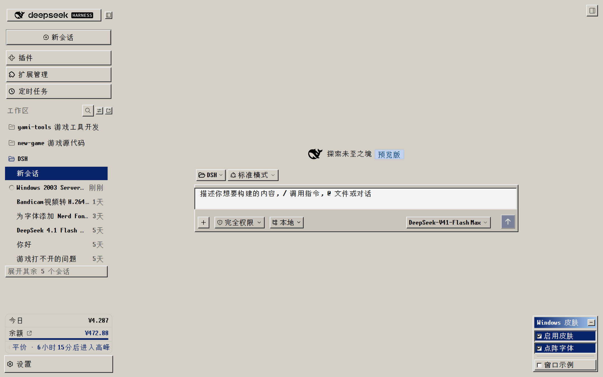
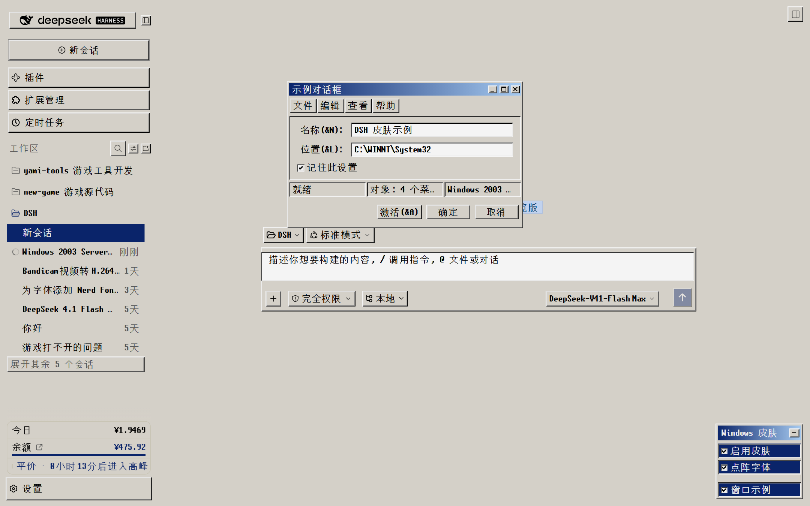
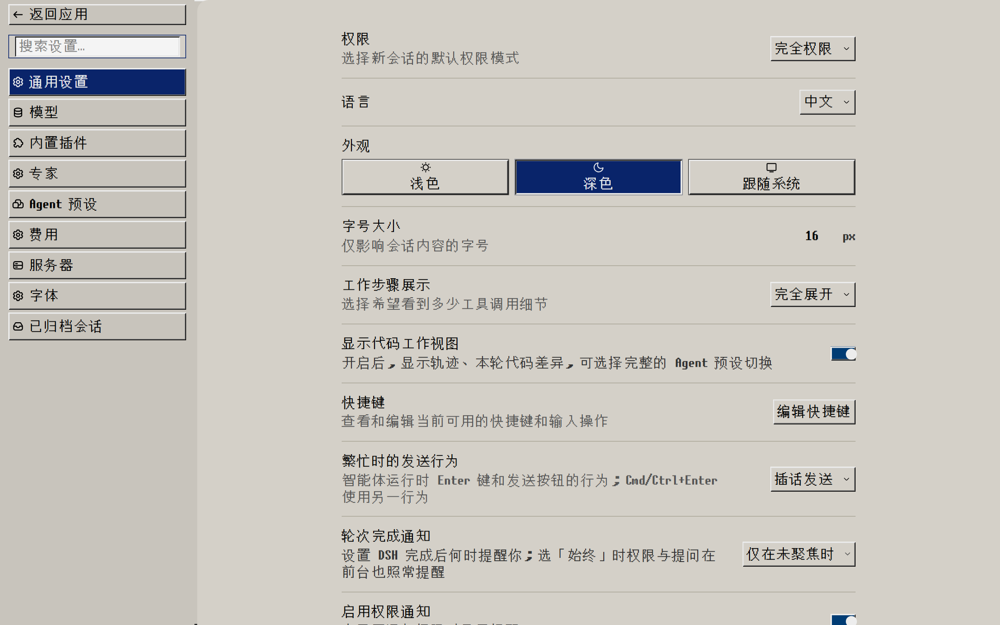

<div align="center">

# dsh-skin-win2000

**Windows 2000 for the DeepSeek Harness Web GUI.**

Classic grey controls, two-tone gradient title bars, 1px bevels, hard square corners, a 16px scrollbar.

[](#install)
[](#install)
[](#development)
[](#license)

**English** · [简体中文](README.md)

</div>

---

## Screenshots

### The interface — grey chrome, navy selection, corner panel



### The classic window — gradient title bar, menu bar, sunken fields and status bar



### The settings surface — form controls, switches and lists



---

## What this is

A **client plugin** for DSH (DeepSeek Harness) that repaints the Web GUI in the visual language of Windows 2000. Install it and it applies itself; a draggable, collapsible panel appears in the bottom-right corner, and one click turns the skin off, restoring DSH exactly as it was.

It does not approximate the era — it takes its values from the era's metric table. Control surfaces, both ends of the active title-bar gradient, the inactive gradient, the three shading greys, the selection highlight: every one of them corresponds to a row in the Windows System Metrics table, and `verify-metrics.mjs` in this repository compares the shipped values against that table and fails when they drift.

## Features

- **Metric-accurate palette** — control surface `#D4D0C8`, active title bar `#0A246A → #A6CAF0`, inactive `#808080 → #C0C0C0`, three shading steps `#F5F5F5 / #808080 / #404040`, selection `#0A246A`
- **Hard square corners** — every `border-radius` is zeroed, and the six `--dsw-radius-*` tokens are pinned to `0px`. All 394 radius declarations across the DSH client packages read those tokens, so this cuts the rounding at the source instead of chasing selectors
- **1px bevels** — every raised and sunken edge is a stepped `inset box-shadow`: raised buttons, sunken fields and code blocks, and a pressed state that inverts the bevel and shifts content by 1px
- **No pure white** — the metric table's `#FFFFFF` ButtonHighlight becomes `#F5F5F5`, the white Window surface becomes `#D4D0C8`. The skin contains no pure-white pixel
- **16px square scrollbar** — grey trough with a stippled track, raised thumb, sunken while dragging
- **Stop is red** — Send and Stop share one button class, so the skin keys on `aria-label`; pausing turns the control a solid `#CC0000`
- **The settings panel** — bottom-right, dragged by its title bar (position remembered), collapsible, with the skin switch, the palette choice and a classic window specimen
- **Your typeface is left alone** — the skin sets no `font-family` anywhere except the Marlett symbol glyphs in the window title buttons. Font and size stay entirely under your DSH font settings
- **No build step** — plain JavaScript, one file, refresh to apply

## Install

The skin is a standard DSH bundle: the package declares `dsh.bundle.patch` pointing at `cordis.patch.yml`, and `dsh.client` for its browser half. The plugin manager accepts a package name, a Git address, an archive or a local path, so any of the three routes below works.

**Route 1 — Git repository (no npm account needed)**

```bash
dsh plugin --profile web add github:lildanger/dsh-skin-win2000
```

The repository must be public, and **the repository root must be the package** (its `package.json` has to carry `dsh.bundle.patch`).

**Route 2 — npm package (indexable by the market)**

```bash
# publisher
npm publish

# user
dsh plugin --profile web add dsh-skin-win2000
```

**Route 3 — local path (for development)**

```bash
dsh plugin --profile web add link:/path/to/dsh-skin-win2000
```

### One more step after installing

When the package is not picked up automatically as a bundle layer (a `link:` install, or a manual copy), insert one row into your profile's `cordis.patch.yml`:

```yaml
- insert:
    - id: skin-win2000
      name: dsh-skin-win2000
```

In the GUI you can also use **Sidebar → Plugins → Add plugin**, paste the package name or Git address, and press **Enable now** when it finishes.

Reload the page. **If nothing changes, force a reload with `Ctrl+Shift+R`** — client bundles are served with a one-year immutable cache, so an ordinary reload keeps the old JavaScript.

### About fonts

The skin **ships the bitmap face it renders with**: `fonts/unsciiCJKV18.otf` (6.37 MB) travels inside the package, served by the host half at `/api/dsh-skin-win2000/fonts/unsciiCJKV18.otf`.

- The `@font-face` declares **no `local()` source**, so a copy installed on the machine can never take precedence — every installation renders identically
- Only that one family is declared, and the stack is `"unsciiCJKV18", monospace`; no family this package does not carry is named
- The response carries `cache-control: public, max-age=604800, immutable`, so a browser fetches it at most once a week, and `font-display: swap` keeps text visible until it lands
- Licence: unscii itself is **public domain** — Viznut's own page says so ("the other variants are in the Public Domain", with only `unscii-16-full` under GPL because of Unifont) — and this face is a CJK extension of it, which a public-domain work permits. Full notes in [fonts/README.md](fonts/README.md)

The rest of the skin **sets no font** (the only exception is the Marlett symbol glyphs in the window title buttons). Switch the panel's pixel-font toggle off and the interface uses your own font settings entirely.

## Using it

The panel in the bottom-right corner:

| Control | What it does |
|---|---|
| Title bar | Drag the whole panel anywhere; the position is remembered in localStorage. **Double-click** to send it back to the corner |
| Button at the right | **Three stages, cycled**: full panel → title bar only → a single small plus → back to the full panel |
| 启用皮肤 (Enable skin) | Toggles the skin. Switching it off restores DSH exactly as it was, while the panel keeps its 2000 chrome so you can switch back |
| 点阵字体 (Bitmap font) | Toggles the bitmap face that ships with the package; switch it off and your own font settings apply |
| 窗口示例 (Window specimen) | Opens a fully reproduced classic dialog: title bar with the three title buttons, menu bar, sunken client area, three-panel status bar and an action row. Click `×` to see the inactive gradient |

The small plus in the last stage is draggable as well — it is the only thing left to grab once the panel is put away, and dragging it never opens the panel by accident.

## Palette

| Interface element | Value | Token |
|---|---|---|
| 3D control surface / taskbar / menu bar | `#D4D0C8` | `--dsw-alias-bg-base` |
| Active title bar, start → end | `#0A246A` → `#A6CAF0` | `--dsh-skin-titlebar-active` |
| Inactive title bar, start → end | `#808080` → `#C0C0C0` | `--dsh-skin-titlebar-inactive` |
| 3D highlight | `#F5F5F5` | `--dsh-skin-shadow-raised` |
| 3D shadow | `#808080` | same |
| Deepest shadow | `#404040` | `--dsw-alias-border-l4` |
| Selection highlight | `#0A246A` | `--dsw-specific-sidebar-nav-item-active` |
| Primary button | `#003C74`, hover `#316AC5` | `--dsw-alias-button-primary-fill` |
| Stop generating | `#CC0000` | matched by `aria-label` |
| Code block | `#C8C4BC` / banner `#BFBBB2` | `--dsw-alias-markdown-code-block` |
| Tooltip bubble | `#FFFFE1` on `#000000` text | `--dsw-alias-tooltip-bg` |

## Verification

Two runnable checks ship with the repository. Neither needs a browser:

```bash
node check.mjs           # spec values, stylesheet, panel and window interactions, dispose
node verify-metrics.mjs  # the Windows 2000 metric table; pure white must be 0
```

`check.mjs` drives the plugin through stubs (module loader, React, DOM) and covers: every `SPEC` constant, the three bevel states, both title-bar gradients, the 11px type size, the absence of any font takeover, the zeroed radii, square scrollbars, the panel and window rules, the bubble colour, the projection attributes, panel folding and the skin switch, the specimen window's title bar / menu / status bar / action row, and the cleanup path.

## Known limitations

- **Some rules depend on hashed class names** — a few rules match CSS-module names by prefix (`[class*="bubble"]`, `[class*="_card"]`). If a DSH upgrade renames them, those rules fail silently and the bubble or card colours fall back to the defaults.
- **The `--dsw-static-*` ramp is rewritten** — it is not DSH's original. A component that uses the brightest static step as *text* colour (the tooltip bubble does exactly that) can end up light-on-light; the skin names the bubble's text colour explicitly for that reason.
- **11px is global** — it is part of the metric table, so body text and code blocks drop to 11px along with the controls.
- **`-webkit-font-smoothing: none` does nothing on Windows Chromium** (it renders through DirectWrite). It is declared, but it cannot change the rendering there.
- **Square corners are indiscriminate** — avatars, status dots and switch knobs all become squares. To keep circles, exclude them from the `border-radius:0 !important` selector.
- **The screenshots are captures** — the three PNGs are taken from a running interface by `tools/capture.mjs` over the Chrome DevTools Protocol, with the skin mounted (`data-dsh-skin="win2000"`). The capture machine uses this author's bitmap-font and palette settings, so type rendering follows those settings.

## Development

```
dsh-skin-win2000/            ← the repository root IS the package
├── client.js                the whole implementation (one file, no build)
├── index.js                 host half placeholder (export function apply() {})
├── package.json             manifest: exports / dsh.bundle / dsh.client
├── cordis.patch.yml         bundle-layer patch
├── check.mjs                minimal runnable check
├── verify-metrics.mjs       colour regression against the metric table
├── tools/capture.mjs        captures the README images over CDP
├── fonts/unsciiCJKV18.otf     the bundled bitmap face (6.37 MB)
├── docs/screenshots/        the three captured PNGs
├── HANDOFF.md               handoff notes: structure, line numbers, pitfalls
├── README.md                the Chinese introduction (the default)
└── workspace/               local scripts and lockfiles (not published)
```

`HANDOFF.md` records nine pitfalls hit while building this (a `:where()` selector flattening specificity to zero, a backtick inside a CSS comment closing a template literal early, the immutable bundle cache, the panel collapsing when the skin attribute is removed, `background-color !important` outranking a primary button's `background` shorthand, and more). Worth reading before changing anything.

## License

MIT
